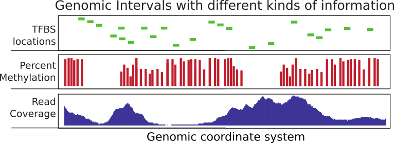
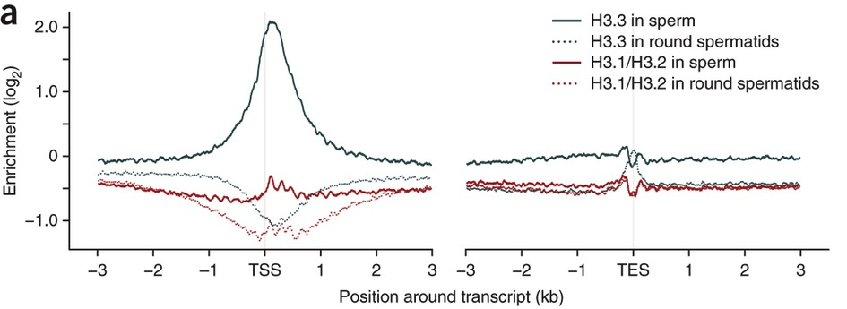
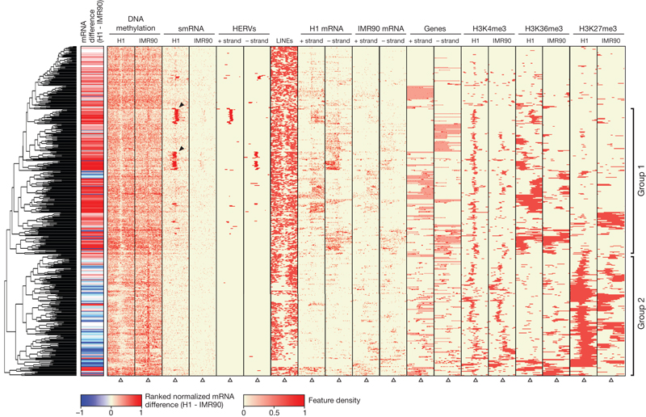
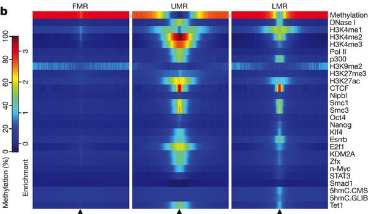

```{r,setup,echo=FALSE}
library(knitr)
opts_chunk$set(echo = TRUE, cache=FALSE,warning=FALSE,message=FALSE)
read_chunk('genomicIntervals_chunks.R')
library(captioner)
fig_nums <- captioner()

```


## Genomic intervals
Are simply coordinates of genomic features (exon,intron,promoter,enhancer, etc.). They can be associated with a score.

 
 
 `r fig_nums("gintsum","Summary of genomic intervals with different kinds of information")`


## You need to operate on genomic intervals to answer the following:

- What are the nearest genes to my peaks?
- Which peaks overlap with enhancers ?
- Which genes overlap with my SNPs ?
- Which exons overlap with my probes?
- How many of my differentially methlated regions overlap with CpG islands ?
- How many reads are there on the exons (feature counts)?


## Does this look familiar ?

<div class="centered">

</div>


## Does this look familiar ?

<div class="centered">

</div>

## Does this look familiar ?

<div class="centered">

</div>

## 
**These were summaries of genomic intervals displayed in different ways. **

Session objectives:

- How to represent genomic intervals in R
- Operations on genomic intervals (counting, overlaps, nearest feature)
- Summarizing and visualizing genomic intervals

## Logistics: The Setup

- Click on Rstudio, click on File/New File/ R script
- Click on Session/ set Working directory/ choose directory
- set the working directory to:

<div style="font-size:20px">
"/data/compgen2016/day2_intro2R_Bioc/GenomicIntervals_data/exercises"
</div>
- type *dir()*, you should see:
```
GenomicIntervalExercises.htmml
```


# Demo

