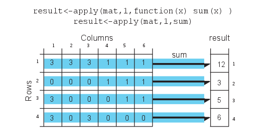

## Aims of Today's session


Aim 1: Go over R basics

 - Installing packages and getting help
 - Understanding data structures and subsetting
 - Making basic plots
 - Using functions and control structures
 - Using apply family of functions
  
## Aims of Today's session

Aim 2: Bioconductor packages useful for genomics data analysis

 - Understanding genomic intervals and how they are used
 - Operating on genomic intervals using BioC packages
 - Visualization and summary of genomic intervals

Aim 3: Go over ggplot2 [Vedran Franke] (if there is time)

## Logistics
The material from this session is at:
http://compgenomr.github.io/book
https://github.com/al2na/compgen2016

The exercises are at:
/compgen2016/day2_intro2R_Bioc/Intro2R_data/exercises


Live notes are at:
https://beta.etherpad.org/p/compgen2016_day2

First, we need you to answer some questions:
http://PollEv.com/altunaakalin


## Logistics: The Setup

- Click on Rstudio, click on File/New File/ R script
- Click on Session/ set Working directory/ choose directory
- set the working directory to "/data/compgen2016/day2_intro2R_Bioc/Intro2R_data/exercises"
- *dir()* in R console
- you should see:
```
intro2R.exercises.html
```

## What is R?

"R is a **free** and **open source** programming language and software environment for statistical computing and graphics."

People use R because:

- Extendible -> thousands of packages
- Graphical interface and output
- Extensive statistics
- Free 

## Packages in R
R packages are add-ons to base R that help you achieve additional tasks that
are not directly supported by base R. It is by the action of these extra 
functionality that R excels as a tool for computational genomics. 

- CRAN (https://cran.r-project.org)
- Bioconductor project (http://bioconductor.org/)
- R-Forge(http://r-forge.r-project.org/)
- GitHub (https://github.com/)

## Installing packages 
You can install CRAN packages using `install.packages()`. (# is the comment character in R)
```{r,eval=FALSE}
# install package named "randomForests" from CRAN
install.packages("randomForests")
```
You can install bioconductor packages with a specific installer script
```{r,eval=FALSE}
# get the installer package
source("http://bioconductor.org/biocLite.R")
# install bioconductor package "rtracklayer"
biocLite("rtracklayer")
```

## Installing packages 
You can install packages from github using `install_github()` function from **devtools**
```{r,eval=FALSE}
library(devtools)
install_github("hadley/stringr")
```
Another way to install packages are from the source.
```{r,eval=FALSE}
# download the source file
download.file("http://goo.gl/3pvHYI",
               destfile="methylKit_0.5.7.tar.gz")
# install the package from the source file
install.packages("methylKit_0.5.7.tar.gz",
                 repos=NULL,type="source")
# delete the source file
unlink("methylKit_0.5.7.tar.gz")
```

## updating CRAN and Bioconductor packages.
```{r,eval=FALSE}
# updating CRAN packages
update.packages()

# updating bioconductor packages
source("http://bioconductor.org/biocLite.R")
biocLite("BiocUpgrade")
```


## Getting help on functions and packages

```{r,eval=FALSE}
library(MASS)
ls("package:MASS") # functions in the package
ls() # objects in your R enviroment
# get help on hist() function
?hist
help("hist")
# search the word "hist" in help pages
help.search("hist")
??hist

```
## More help needed?
- google it! -> pay attention to hits from  R-help, Stackoverflow and R-bloggers
- BioC packages have to have vignettes, they usually have useful info.


## Computations in R
```{r,eval=FALSE}
2 + 3 * 5       # Note the order of operations.
log(10)        # Natural logarithm with base e
5^2            # 5 raised to the second power
3/2            # Division
sqrt(16)      # Square root
abs(3-7)      # Absolute value of 3-7
pi             # The number
exp(2)        # exponential function
# This is a comment line
```

# Exercises 2.1-2.8


## Data structures
- Think of data structures as building blocks of a table and the table itself, and a table is similar to a sheet in excel.
- Most of the time you will manipulate tabular data structures
- R deals with named data structures, this means you can give names to data structures and manipulate or operate on them using those names.

## Vectors
- are a list of elements of the same type (numeric,character or logical). 
- you will see that every column of a table will be represented as a vector.
- You can create vectors with `c()` function ( not the only way). 
- The operations on vectors will propagate to all the elements of the vectors.
- They are also called "atomic vectors", because they are the most basic type
  of data representation in R.

## Vectors 
```{r,eval=FALSE}
x<-c(1,3,2,10,5)    #create a vector named x with 5 components
x = c(1,3,2,10,5)  
x
y<-1:5              #create a vector of consecutive integers y
y+2                 #scalar addition
2*y                 #scalar multiplication
y^2                 #raise each component to the second power
2^y                 #raise 2 to the first through fifth power
y                   #y itself has not been unchanged
y<-y*2
y                   #it is now changed
r1<-rep(1,3)        # create a vector of 1s, length 3
length(r1)           #length of the vector
class(r1)            # class of the vector
a<-1                # this is actually a vector length one
```


## Data types
The four most common data types in R are:

- **numeric**
- **logical**
- **character** 
- **integer**

 All these data types can be used to create vectors natively.
 
## Data types
```{r,eval=FALSE}
#create a numeric vector x with 5 components
x<-c(1,3,2,10,5)
x
#create a logical vector x
x<-c(TRUE,FALSE,TRUE)
x
# create a character vector
x<-c("sds","sd","as")
x
class(x)
# create an integer vector
x<-c(1L,2L,3L)
x
class(x)
```

# Exercises 3.1-3.10

## Matrices
- A matrix refers to a numeric array of rows and columns.
- stacked version of vectors where each row or column is a vector. 
- combine vectors of equal length using `cbind()`, meaning 'column bind'.

```{r,eval=FALSE}
x<-c(1,2,3,4)
y<-c(4,5,6,7)
m1<-cbind(x,y);m1
t(m1)                # transpose of m1
dim(m1)              # 2 by 5 matrix
```

## Matrices
You can also directly list the elements and specify the matrix:
```{r,eval=FALSE}
m2<-matrix(c(1,3,2,5,-1,2,2,3,9),nrow=3)
m2
```

## Matrices
Matrices and the next data structure **data frames** are tabular data structures. You can subset them using **[]** and providing desired rows and columns to subset. 

<div class="centered">

</div>

## Matrices
You can subset them using also using column names in **[]** but not with **$**
notation.

```{r,eval=FALSE}
m3<-matrix(1:20,ncol=2)
m3
colnames(m3)=c("start","end")
m3[,"start"]
  
```

## Data Frames

- A data frame is more general than a matrix
- Different columns can have different classes and data types (numeric, character, factor, etc.). A data frame can be constructed by `data.frame()` function. 

## Data Frames
Constructing a data frame from genomic intervals or coordinates.

```{r,eval=FALSE}
chr <- c("chr1", "chr1", "chr2", "chr2")
strand <- c("-","-","+","+")
start<- c(200,4000,100,400)
end<-c(250,410,200,450)
mydata <- data.frame(chr,start,end,strand)
#change column names
names(mydata) <- c("chr","start","end","strand")
mydata # OR this will work too
mydata <- data.frame(chr=chr,start=start,end=end,strand=strand)
mydata
```

## Data Frames: subsetting and filtering
- You can extract certain columns using column numbers or names
- You can extract certain rows by using row names or numbers. 
- You can also extract data using logical arguments, such as extracting all rows that has a value in a column larger than your threshold.
```{r,eval=FALSE}
mydata[,2:4] # columns 2,3,4 of data frame
mydata[,c("chr","start")] # columns chr and start from data frame
mydata$start # variable start in the data frame
mydata[c(1,3),] # get 1st and 3rd rows
mydata[mydata$start>400,] # get all rows where start>400
```

# Exercises 3.11-3.24

## Lists
- An ordered collection of objects (components)
- A list allows you to gather a variety of (possibly unrelated) objects under one name
- Good way to create conceptual entities of related data structures
```{r,eval=FALSE}
# example of a list with 4 components
# a string, a numeric vector, a matrix, and a scalar
w <- list(name="Fred",
       mynumbers=c(1,2,3),
       mymatrix=matrix(1:4,ncol=2),
       age=5.3)
w
```


## Lists
You can extract elements of a list using the **[[]]** convention using either its position in the list or its name.
```{r,eval=FALSE}
w[[3]] # 3rd component of the list
w[["mynumbers"]] # component named mynumbers in list
w$age
```

## Factors
- Factors are used to store categorical data. 
- They are important for statistical modeling since categorical variables are treated differently in statistical models than continuous variables. 
- Using factors ensures categorical data treated accordingly in statistical models.
```{r,eval=FALSE}
features=c("promoter","exon","intron")
f.feat=factor(features)
```

## Factors
Important thing to note is that when you are reading a data.frame with read.table() or creating a data frame with `data.frame()` character columns are stored as factors by default. 

- To change this behavior you need to set `stringsAsFactors=FALSE` in `read.table()` and/or `data.frame()` function arguments.

# Exercises 3.25-3.32

## Reading data into R
- Most of the genomics data sets are will be in table format with columns denoting chromosome, start positions, end positions, strand and score. 
- One of the popular formats is BED format used primarily by UCSC genome browser 
- In R, you can easily read tabular format data with read.table() function.
```{r,eval=FALSE}
# read enhancer marker BED file
enh.df <- read.table("../data/subset.enhancers.hg18.bed", header = FALSE)  
# read CpG island BED file
cpgi.df <- read.table("../data/subset.cpgi.hg18.bed", header = FALSE) 
# check first lines to see how the data looks like
head(enh.df)
head(cpgi.df)
```

## Writing data out to a text file or other formats
- You can save your data by writing it to disk as a text file. 
- A data frame or matrix can be written out by using `write.table()` function. 
- we will write the `cpg.df` out as a tab-separated file, pay attention to the arguments.
```{r,tidy=FALSE,eval=FALSE}
write.table(cpgi.df,file="cpgi.txt",quote=FALSE,
            row.names=FALSE,col.names=FALSE,sep="\t")
```

## Writing data out to a text file or other formats
You can save your R objects directly into a file using:

- `save()` and `saveRDS()` 
load them back in with:
- `load()` and `readRDS()`. 

By using these functions you can save any R object whether or not they are in data frame or matrix classes.
```{r,eval=FALSE}
save(cpgi.df,enh.df,file="mydata.RData")
load("mydata.RData")
# saveRDS() can save one object at a time
saveRDS(cpgi.df,file="cpgi.rds")
x=readRDS("cpgi.rds")
head(x)
```

## Note on save() and load()
- with `save()` you can save many objects at a time and when they are loaded into memory with load() they retain their variable names. 

- when you save an object by `saveRDS()` and read by `readRDS()` the name of the object is not retained, you need to assign the output of readRDS() to a new variable (“x” in the previous slide).

# Exercises 4.1-4.14

## Plotting in R: Histogram
R has great support for plotting and customizing plots. 

We will sample sample 50 values from normal distribution and plot them as a histogram.

```{r,fig.show='hide'}
# sample 50 values from normal distribution
# and store them in vector x
set.seed(101)
x<-rnorm(50)
hist(x) # plot the histogram of those values
```

## Plotting in R: Histogram
- We can modify all the plots by providing certain arguments to the plotting function. - **'main'** argument gives title to the plot. 
- **'col'** argument can be used to change the color.
```{r,fig.show='hide'}
hist(x,main="Hello histogram!!!",col="red")
```

## Plotting in R: scatter plot
- Scatterplot shows values of two variables for a set of data points.
- It is useful to visualize relationships between two variables. Used in connection with correlation and linear regression. 
- Using extra arguments : **“xlab”** and **“ylab”** 
- See **?plot** and **?par** for more arguments that can help you customize the plots.
```{r,fig.show='hide'}
# randomly sample 50 points from normal distribution
y<-rnorm(50)
#plot a scatter plot
# control x-axis and y-axis labels
plot(x,y,main="scatterplot of random samples",
        ylab="y values",xlab="x values")
```


## Plotting in R: boxplot
- plot boxplots for vectors x and y. 


```{r,eval=FALSE}
 boxplot(x,y,main="boxplots of random samples")
```
- Boxplots depict groups of numerical data through their spread. 
- The edges of the box denote 1st and 3rd quartiles
- The line that crosses the box is the median. Whiskers usually are defined using interquartile range:

*lowerWhisker=Q1-1.5[IQR] and upperWhisker=Q1+1.5[IQR]*

outliers can be depicted as dots. In this case, outliers are the values that remain outside the whiskers.

## Plotting in R: barplot
We are going to plot four imaginary percentage values as bars and color them with two colors, and this time we will also show how to draw a legend on the plot using **legend()** function.

```{r,tidy=FALSE,,eval=FALSE}
perc=c(50,70,35,25)
barplot(height=perc,names.arg=c("CpGi","exon","CpGi","exon"),
        ylab="percentages",main="imagine %s",
        col=c("red","red","blue","blue"))
legend("topright",legend=c("test","control"),fill=c("red","blue"))
```

## Saving plots
 If you want to save your plots to an image file there are couple of ways of doing that. Normally, you will have to do the following:
 1. Open a graphics device
 2. Create the plot
 3. Close the graphics device

```{r,eval=FALSE}
pdf("mygraphs/myplot.pdf",width=5,height=5)
plot(x,y)
dev.off()
```
 Alternatively, you can first create the plot then copy the plot to a graphic device.
```{r,eval=FALSE}
plot(x,y)
dev.copy(pdf,"mygraphs/myplot.pdf",width=7,height=5)
dev.off()
```

## Other plotting frameworks: ggplot2
```{r,fig.height=3,fig.width=3}
library(ggplot2)
dat=data.frame(x=x,y=y)
ggplot(dat, aes(x=x, y=y)) + geom_point(shape=1) + # Use hollow circles
   geom_smooth(method=lm)  # Add linear regression line
```

http://www.cookbook-r.com/Graphs/index.html

# Exercises 5.1-5.23

## User defined functions in R
- Functions are useful for transforming larger chunks of code to re-usable pieces of code. 
- A function in R takes different arguments and returns a definite output, much like mathematical functions. 
- This simple function takes two arguments, x and y, and returns the sum of their squares.
```{r,eval=FALSE}
sqSum<-function(x,y){
result=x^2+y^2
return(result)
}
# now try the function out
sqSum(2,3)
```


## User defined functions in R
Functions can also output plots and/or messages to the terminal. Here is a function that prints a message to the terminal:
```{r}
sqSumPrint<-function(x,y){
result=x^2+y^2
cat("here is the result:",result,"\n")
}
# now try the function out
sqSumPrint(2,3)
```

## if/else conditionals in R
- Sometimes we would want to execute a certain part of the code only if certain condition is satisfied. 
- The condition can be anything from the type of an object (Ex: if object is a matrix execute certain code), or it can be more complicated. 
- we use **if/else** to control the which parts of the code is executed
```{r}
a=1
if(a == 1){
 cat("a is 1")
}else{
  cat("a is not 1")
}

```

## if/else conditionals in functions
```{r,eval=FALSE}
cpgi.df <- read.table("../data/subset.cpgi.hg18.bed", header = FALSE)
# function takes input one row
# of CpGi data frame
largeCpGi<-function(bedRow){
 cpglen=bedRow[3]-bedRow[2]+1
 if(cpglen>1500){
	cat("this is large\n")
 }
 else if(cpglen<=1500 & cpglen>700){
	cat("this is normal\n")
 }
 else{
	cat("this is short\n")
 }
}
largeCpGi(cpgi.df[10,])
largeCpGi(cpgi.df[100,])
largeCpGi(cpgi.df[1000,])
```

# Exercises 6.1-6.5

## Loops and looping structures in R
- use loops when you need to repeat a certain task 
- A loop will execute the task until a certain condition is reached. 
- The loop below is called a “for loop” and it executes the task sequentially 10 times.
```{r,eval=FALSE}
for(i in 1:10){ # number of repetitions
cat("This is iteration") # the task to be repeated
print(i)
}
```

## Loops and looping structures in R
- calculate the length of the CpG islands we read in earlier.
- we will calculate the length of the CpG islands for the first 100 islands (by subtracting the end coordinate from the start coordinate)
- This is not the most efficient way but a good example for loops
```{r,eval=FALSE}
# this is where we will keep the lenghts
result=c()# for now it is an empty vector
# start the loop
for(i in 1:100){
    #calculate the length
	len=cpgi.df[i,3]-cpgi.df[i,2]+1
    #append the length to the result
	result=c(result,len)
}
# check the results
head(result)
```

## apply() family functions instead of loops
- R has other ways of repeating tasks that tend to be more efficient than using loops. - They are known as the **“apply”** family of functions, which include *apply, lapply, mapply and tapply* (and some other variants).
- All of these functions apply a given function to a set of instances and returns the result of those functions for each instance. 

## apply() family functions instead of loops
- The difference between apply family functions is that they take different type of inputs. 
- `apply` works on data frames or matrices and applies the function on each row or column of the data structure. 
- `lapply` works on lists or vectors and applies a function which takes the list element as an argument. 

## apply() function
The next example applies the sum function on the rows of a matrix, it basically sums up the values on each row of the matrix, which is conceptualized in Figure below.

<div class="centered">

</div>

## apply() function
```{r,}
mat=cbind(c(3,0,3,3),c(3,0,0,0),c(3,0,0,3),c(1,1,0,0),c(1,1,1,0),c(1,1,1,0))
result<-apply(mat,1,sum)
result
# OR you can define the function as an argument to apply()
result<-apply(mat,1,function(x) sum(x))
result
```

## apply() function
<div class="centered">

</div>
- we change the second argument to 2, this will indicate that columns should be the input for the function that will be applied.


## apply() function
```{r}
result<-apply(mat,2,sum)
result
```

## lapply() function
Next, we will use **lapply()**, which applies a function on a list or a vector. The function that will be applied is a simple function that takes the square of a given number.

```{r}
input=c(1,2,3)
lapply(input,function(x) x^2)
```


## mapply() function
<div class="centered">


</div>


- **mapply()**  can apply a function on an unlimited set of vectors/lists, a version of lapply that can handle multiple vectors as arguments. 
- In this case, the argument to the mapply() is the function to be applied and the sets of parameters to be supplied as arguments of the function.


## mapply() function

```{r}
Xs=0:5
Ys=c(2,2,2,3,3,3)
result<-mapply(function(x,y) sum(x,y),Xs,Ys)
result
```

## apply family functions on multiple cores
<div class="centered">

</div>
`mcmapply` runs the summation function on three different processors. Each processor executes the summation function on a part of the data set, and the results are merged and returned as a single vector that has the same order as the input parameters Xs and Ys.


## Vectorized Functions in R
- The above examples have been put forward to illustrate functions and loops in R because functions using sum(). You will probably need to use loops and looping structures with more complicated functions. 
- In reality, most of the operations we used do not need the use of loops or looping structures because there are already vectorized functions.

## Vectorized Functions in R
For example, instead of using mapply() and sum() functions we can just use + operator and sum up Xs and Ys.
```{r}
result=Xs+Ys
result
```

## Vectorized Functions in R
In order to get the column or row sums, we can use the vectorized functions colSums() and rowSums().
```{r}
colSums(mat)
rowSums(mat)
```
However, remember that not every function is vectorized in R, use the ones that are. But sooner or later, apply family functions will come in handy.

# Exercises 6.6-6.9

## Session info
```{r}
sessionInfo()
```
